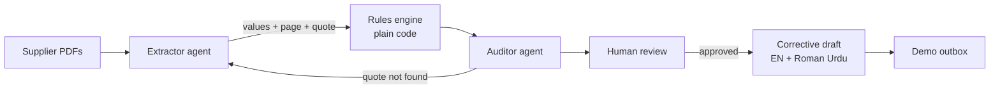

# ChainAudit

**Every compliance decision, traceable to a line on a page.**

ChainAudit checks supplier evidence (PDF, PNG, JPG) against a buyer's configured requirements. Agents read the documents, a rules engine written as plain code decides, an independent **Auditor** checks every quote against the page it came from, and a person has the last word.

**Live demo: https://chainaudit-two.vercel.app**

> Runs on **Synthetic Demo Data** and a **Demo Buyer Framework**. No real supplier, buyer or certificate is involved, and no accuracy figure is claimed.

---

## Try it in 60 seconds

1. Open the [live demo](https://chainaudit-two.vercel.app) and choose **Watch a recorded run** (works any time, no backend needed).
2. Play **Failed supplier**. Watch the Agent Trace fill in, then open the `CHEM_MAX` finding to see the exact quote and value (17.4 ppm against a 15 ppm limit).
3. Open `ID_CONSISTENCY`. Two documents carry different batch IDs (BT-2047 and BT-2041), shown side by side for a human to decide.
4. In **Rules**, change the chemical limit from 15 to 20 and press **Re-check**. The verdict flips with **0 model calls**, because the rules engine re-reads cached evidence.
5. Approve a finding, switch the draft between English and Roman Urdu, and **Send to demo outbox** (only possible after approval).
6. Play **Auditor loop** to see the Auditor challenge a wrong value and the Extractor re-read the page.

Uploading your own PDFs needs the live backend. It runs on free hosting, so it sleeps when idle and can take about a minute to wake. The recorded runs always work.

## How it works



| Step | Who | What it does |
|---|---|---|
| Read | Extractor (LLM) | Pulls values from each document. Every value keeps its page and exact quote. Unsupported values stay empty. |
| Decide | Rules engine (code) | Compares values with the buyer's rules. No model makes pass or fail calls. |
| Check | Auditor | Looks for every quote in the document text. A missing quote triggers a re-read. It can challenge a value but never change a verdict. |
| Review | Human | Approve, edit, reject or ask for more evidence. |
| Act | Corrective agent | Drafts a message to the supplier. Drafts are labelled "AI draft. Review before sending." and only reach the demo outbox after approval. |

The UI streams the whole run live over Server-Sent Events, so the trace you see is the real event log, not an animation.

## Demo Buyer Framework v1.0

| Rule | Check |
|---|---|
| `CHEM_MAX` | Maximum chemical concentration (15 ppm) |
| `CERT_REQUIRED` | Required certification valid on the reference date |
| `DOC_FRESH` | Test report not older than 60 days |
| `ID_CONSISTENCY` | Supplier and batch identity consistent across documents |

Statuses are deliberately cautious: *Passing*, *Requirement not satisfied*, or *Human review*. Conflicting documents are reported as a potential inconsistency requiring human review.

## Tech stack

- **Frontend:** Next.js 15, React 19, TypeScript, Tailwind CSS, TanStack Query. Deployed on Vercel.
- **Backend:** FastAPI, SQLAlchemy (SQLite), sse-starlette, PyMuPDF for page text and rendering. Deployed as a Docker container.
- **LLMs:** provider-agnostic. `mock` (offline), `groq`, `nvidia`, `gemini` (free tiers, OpenAI-compatible), `openai`, `anthropic`. Currently running on Groq with `openai/gpt-oss-120b`.
- **Contract:** `docs/openapi.json` is the API contract and a test fails if it goes stale.

## Run it locally

**Backend** (Python 3.12 recommended):
```bash
cd backend
python -m venv .venv && source .venv/bin/activate   # Windows: .venv\Scripts\Activate.ps1
pip install -r requirements.txt
cp .env.example .env          # LLM_PROVIDER=mock works fully offline
uvicorn app.main:app --port 8000
```

To use a real model, set in `backend/.env`:
```
LLM_PROVIDER=groq
GROQ_API_KEY=your_key
LLM_MODEL=openai/gpt-oss-120b
```
then `pip install openai` and run `python scripts/check_provider.py` as a 10-second smoke test.

**Frontend:**
```bash
cd frontend
npm install
cp .env.local.example .env.local   # NEXT_PUBLIC_MOCK=1 = fully offline on recorded runs
npm run dev                        # http://localhost:3000
```
For the live backend set `NEXT_PUBLIC_API_URL=http://localhost:8000` and `NEXT_PUBLIC_MOCK=0`.

**Tests:** `cd backend && make test` runs 98 tests with no network.

Sample inputs are in `demo_data/` (`clean_supplier/`, `failed_supplier/`, plus robustness files such as a prompt-injection PDF and a scan-like PDF).

## Repository layout

```
backend/    FastAPI app: agents, rules engine, auditor, API, tests
frontend/   Next.js control center (landing, overview, run, review, audit record)
demo_data/  Synthetic PDFs, expected outcomes, recorded replays
docs/       API contract, design decisions, agent card, handover
DEPLOY.md   Deployment notes
```

## Limitations (stated plainly)

- No authentication or multi-tenancy. This is a hackathon demo.
- SQLite on a single process. Uploaded data is lost when the free container restarts.
- Real-model behaviour (accuracy, vision extraction) is unmeasured. No accuracy number is claimed.
- The mock provider only understands the generated demo layout.
- The offline site computes review decisions and rule re-checks in the browser and says so on screen.

## More

- [`DEPLOY.md`](DEPLOY.md): Vercel plus a free container host, and the gotchas we hit
- [`docs/DECISIONS.md`](docs/DECISIONS.md) and [`docs/AGENT_CARD.md`](docs/AGENT_CARD.md): design choices and what each agent may and may not do
- [`backend/README.md`](backend/README.md): backend run guide and live-provider checklist

Built by [@abdul-rafay19](https://github.com/abdul-rafay19) for a hackathon.
